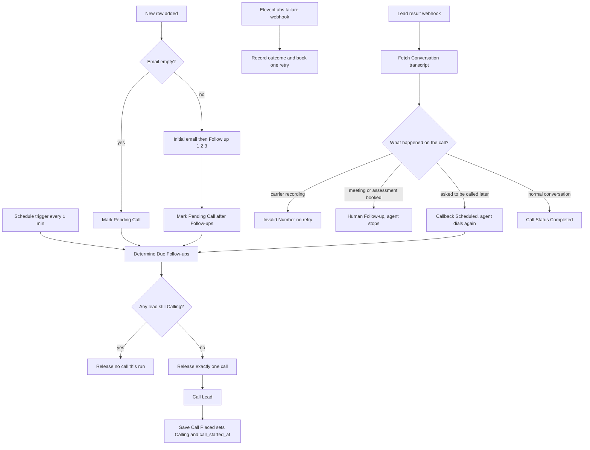

# Call queue + retry setup (unanswered / declined)

Use **`voice plus email (3).json`** — this is now the current workflow. It replaces the
older `voice plus email.json`.

What was added:

1. **One call at a time.** Leads are queued and dialled serially, so you never hit the
   ElevenLabs Starter limit of 3 simultaneous calls, even if 20 leads arrive at once.
2. **Didn't pick / declined handling.** The outcome is written to the sheet and the lead
   gets exactly **one retry after 24 hours** (60 seconds while `TESTING = true`).
3. **Wrong / dead numbers**, including carriers that answer with a recording instead of
   rejecting the call. No digit-length rules, since the leads are global.
4. **Callback vs booked meeting.** A requested callback is dialled by the agent. A booked
   meeting or assessment goes into its own column and is handed to a real person, and the
   agent never dials that lead again.
5. **The agent knows which email it is calling about.** The real sent email is fetched from
   Gmail and passed in as dynamic variables.

## 1. Google Sheet columns

Add these headers to the `Leads` sheet:

| Column | Purpose |
|---|---|
| `conversation_id` | Last ElevenLabs conversation ID |
| `call_attempt_count` | `1` on first dial, `2` on the retry |
| `call_retry_at` | When the agent next dials this lead (`dd MMM yyyy HH:mm:ss`) |
| `last_call_outcome` | `Didn't Pick`, `Declined`, `Callback Requested`, `Meeting Booked`, `answered`, ... |
| `call_started_at` | When the current call was placed (this is the queue lock) |
| `meeting_datetime` | **New.** When a booked meeting / assessment is due. A human calls, not the agent |
| `meeting_type` | **New.** `Meeting`, `Assessment` or `Demo`, so the human knows what to prepare |
| `callback_count` | **New.** How many times this lead has asked to be called back |

`call_started_at` is required. Without it the queue cannot tell whether a call is still live.

The call path also reads the existing `Id ` and `Thread Id` columns to fetch the sent email
back out of Gmail, so leave those two alone.

After adding the columns, open each Google Sheets node in n8n and refresh the column list.

### Transcripts sheet (separate tab)

Create a second tab called **Transcripts** in the same spreadsheet with these headers:

| Column | Content |
|---|---|
| `Serial No` | Links back to the lead in the Leads sheet |
| `Name` | Client name |
| `conversation_id` | ElevenLabs conversation ID |
| `call_attempt` | Which attempt this was (1, 2, ...) |
| `call_status` | The classified outcome (`Completed`, `Callback Scheduled`, etc.) |
| `timestamp` | When the call happened (IST) |
| `duration_seconds` | How long the call lasted |
| `transcript` | The full conversation as readable text (`Agent: ... / Client: ...`) |

Every answered call appends a new row, so retries and callbacks each get their own transcript
entry. Failed calls (no-answer, declined, unreachable) have no transcript and are not written
here.

After importing the workflow, open the `Save Transcript` node in n8n and refresh the column
list so it picks up the new tab.

## 2. How the queue works

Nothing is called the moment it becomes eligible. **Both** kinds of lead are put into the
same queue as `Pending Call`, and the 1-minute scheduler dials them one at a time:

- **No email** - marked `Pending Call` as soon as the row is added.
- **Has email** - marked `Pending Call` right after `Follow up 3` is sent. The call still
  waits for the normal gap after Follow up 3 (2 days in production), the queue just tracks
  it explicitly instead of relying on `Call Status` being blank.



`Call Status` values used by the queue:

| Value | Meaning |
|---|---|
| `Pending Call` | Queued, waiting its turn |
| `Calling` | Live call, blocks every other lead |
| `Didn't Pick - Retry Scheduled` | No answer, one retry booked |
| `Declined - Retry Scheduled` | Declined or busy, one retry booked |
| `Unreachable - Retry Scheduled` | Phone off, out of network, or connection error, one retry booked |
| `No Response - Retry Scheduled` | Call was answered but nothing came back (voicemail or dead air), one retry booked |
| `Callback Scheduled` | Client asked to be called later. **The agent dials again** at `call_retry_at` |
| `Meeting Scheduled - Human Follow-up` | Meeting booked. **A real person calls**, the agent never dials again |
| `Assessment Scheduled - Human Follow-up` | Assessment booked, same handover to a human |
| `Callback Limit Reached - Human Follow-up` | Asked to be called back too many times, a human takes over |
| `... - Needs Review` | The agent gave a time nobody can parse, so a human must set it |
| `... - Retry Exhausted` | Second failure, no more calls |
| `Invalid Number - No Retry` | Carrier says the number is not a working number, never called again |
| `Completed` | A real conversation happened with no callback and no booking |

Anything containing **`Human Follow-up`** or **`Needs Review`** is a dead end for the agent.
Those rows are your human call list.

Rows already past `Follow up 3` with a blank `Call Status` are still picked up by a legacy
fallback rule, so leads created before this change are not stranded.

**Deadlock protection:** if a row is stuck on `Calling` for longer than the lock window
(3 minutes in testing, 15 minutes in production) it is treated as stale, so the queue
keeps moving and that lead is retried.

## 3. ElevenLabs (required)

No agent prompt change is needed. Unanswered and declined calls are telephony events.

1. Open **Agents Platform → your agent → Post-call webhooks**.
2. Add: `https://<your-n8n-host>/webhook/elevenlabs/call-initiation-failure`
3. Subscribe it to **`call_initiation_failure`**.
4. Keep the existing `/webhook/elevenlabs/lead-call-result` webhook for answered calls.

Mapping applied by `Prepare Call Failure Update`:

| Carrier / ElevenLabs signal | Sheet outcome | Retried? |
|---|---|---|
| SIP `404`, `410`, `484`, `604`, or wording such as `does not exist`, `not in service`, `unallocated`, `number not found` | `Invalid Number` | no, never |
| `failure_reason: busy`, or SIP `486` / `603` | `Declined` | yes, once |
| `failure_reason: no-answer`, or SIP `408` | `Didn't Pick` | yes, once |
| SIP `480` / `502` / `503` / `504`, provider status `failed`, `failure_reason: unknown` | `Unreachable` | yes, once |

### Wrong number and out-of-network handling

There is **no digit-count validation anywhere**, because leads are global and national
number lengths vary. A number is only treated as wrong when the **carrier itself** says so.

| Situation | What happens |
|---|---|
| Carrier answers with "the number you are trying to reach does not exist" style signals, or returns SIP `404` / `410` / `484` / `604` | `Invalid Number - No Retry`. The lead is never dialled again, so no retry is wasted on a dead number. |
| ElevenLabs rejects the destination when the call is placed | `Merge Call Info` scans the API response for the same wording and writes `Invalid Number - No Retry`. |
| Phone switched off or out of network | `Unreachable - Retry Scheduled`, retried once after 24 hours. |
| ElevenLabs API or network error while dialling | `Unreachable - Retry Scheduled`, and the queue lock is released immediately so other leads keep moving. |
| Lead row has no `phone_number` at all | Skipped by the scheduler. It stays `Pending Call` and never holds the queue lock. |

The carrier wording is matched against the whole `metadata` object the provider sends, not
just one field, so the phrase is caught wherever it appears in the payload.

### Dead numbers that ANSWER the call

Some carriers do not reject a dead number. They **answer** it and play a recording such as
*"the number you are trying to reach does not exist"*. ElevenLabs sends **no**
`call_initiation_failure` in that case, because the call connected, so the agent ends up
talking to a recording and the row would otherwise be saved as `Completed`.

The answered path therefore no longer trusts the agent blindly:

```
Webhook (lead-call-result)
  -> Get Rows (Call Result Lookup)     find the row, read its conversation_id
  -> Resolve Conversation
  -> Fetch Conversation                GET /v1/convai/conversations/{id}
  -> Classify Call Result
  -> Update row in sheet
```

`Classify Call Result` reads the real transcript and only inspects what **the other side**
said, never the agent's own lines:

| What the transcript shows | Result |
|---|---|
| Other side says `does not exist`, `not in service`, `has been disconnected`, `unallocated`, `wrong number`, `number you have dialed`, ... | `Invalid Number - No Retry` |
| Call answered but the other side never said anything, and it lasted 20 seconds or less | `No Response - Retry Scheduled` (voicemail or dead air, one more try) |
| A normal two-sided conversation | `Completed`, with the agent's outcome fields saved as before |

Safe fallbacks: if the conversation is still `in-progress` when the webhook fires, or the
ElevenLabs API call fails, the row is saved as `Completed` exactly as it used to be. The
transcript check can only ever downgrade a call it has real evidence about.

Note that a **human** saying "you have the wrong number" is also treated as
`Invalid Number - No Retry`, since that number does not belong to the lead either.

## 4. Callback vs booked meeting

These are two different things and they now go to two different places.

| The client said | Column used | Who calls next |
|---|---|---|
| "call me later" / "call me tomorrow at 4" | `callback_datetime` | **The agent.** `call_retry_at` is set to that time and the queue dials it |
| "book me a meeting / assessment" | `meeting_datetime` + `meeting_type` | **A real person.** The agent never dials this lead again |

`Classify Call Result` decides in this order, so the outcomes can never collide:

1. Carrier recording answered → `Invalid Number - No Retry`
2. Answered but silent and 20 seconds or less → `No Response - Retry Scheduled`
3. A meeting / assessment time was given → **human handover**
4. A callback time was given → **agent dials again**
5. Anything else → `Completed`

**A booking always wins over a callback.** If the agent fills in both, the booking is used
and the callback is dropped, because a person who agreed to meet must never be robo-dialled.
There is also a safety net for the transition period: if the outcome says a meeting or
assessment was booked but the agent only filled `callback_datetime`, that timestamp is moved
into `meeting_datetime` and no automated call is scheduled.

Other real-world guards:

- **A callback is not a retry.** `call_attempt_count` is reset to `0` when a callback is
  booked, so the no-answer retry budget from the earlier call does not swallow it.
- **Endless "call me later" is capped.** After `MAX_CALLBACKS = 3` requests the row becomes
  `Callback Limit Reached - Human Follow-up` instead of looping forever in the queue.
- **Unparseable times are never guessed.** If the agent returns something like
  `"tomorrow afternoon"`, the row becomes `... - Needs Review` and keeps the raw text, rather
  than the agent picking a time and calling at 3am.
- **Past times dial immediately** rather than being silently skipped.

Accepted time formats: ISO 8601 (`2026-08-20T11:30:00`), `dd MMM yyyy HH:mm:ss`,
`yyyy-MM-dd HH:mm`, `dd/MM/yyyy HH:mm`, `dd-MM-yyyy HH:mm`, and 12-hour variants.

### Required ElevenLabs agent change

This is the one part that is **not** in the n8n file. In **Agents Platform → your agent →
Analysis → Data collection**, add a field alongside the existing `callback_datetime`:

| Field | Type | Description to give the agent |
|---|---|---|
| `meeting_datetime` | string | "If the client agrees to book a meeting or assessment, the date and time they agreed, in ISO 8601 format. Leave empty if they only asked to be called back later." |
| `meeting_type` | string | "`Assessment`, `Meeting` or `Demo`. Leave empty if nothing was booked." |

Then tighten the existing `callback_datetime` description so the agent stops using it for
bookings: *"Only when the client asks to be called back later. If they booked a meeting or
assessment, use `meeting_datetime` instead."*

Finally add the two new fields to the body your agent posts to
`/webhook/elevenlabs/lead-call-result`. The workflow also accepts `assessment_datetime`,
`appointment_datetime`, `meeting_schedule_time` and `assessment_schedule_time`, so use
whichever name you prefer.

In the agent prompt, make the distinction explicit, for example: *"If they want a meeting or
assessment, confirm the date and time and tell them a member of the team will call them then.
If they just want to be called back later, confirm the time and tell them you will call
back."*

## 5. What the agent is told about the email

The agent used to receive only `lead_id` and `client_name`, so it had no idea which pitch the
lead had read. It now receives the **actual email that was sent**, pulled back out of Gmail.

```
Is Call Due? (true)
  -> Was Email Sent?        is there a stored message id for this lead?
       |-- yes -> Fetch Initial Email    Gmail: get message by Id
       |            -> Build Call Context
       |-- no  ------> Build Call Context
  -> Call Lead
```

Fetching from Gmail rather than re-rendering the template means the agent sees exactly what
the client received. It cannot drift when you reword a template, and there is no second copy
of the email content to maintain.

Dynamic variables now sent to ElevenLabs:

| Variable | Value |
|---|---|
| `lead_id` | unchanged |
| `client_name` | unchanged |
| `email_sent` | `yes` or `no` |
| `email_subject` | Subject line of the initial email, or empty |
| `email_body` | The initial email as plain speakable text, or empty |
| `industry_pain_points` | Short category brief, filled in **only** when there is no email body |

Details that matter in practice:

- **HTML is converted to speech-safe text.** Tags are stripped, and links keep only their
  label, so the agent never reads `<p>` or a raw URL out loud.
- **A lead with no email address never gets an email claim.** It receives `email_sent = no`
  plus the category brief, so the agent must not open with "did you get my email?".
  Guard this in the prompt.
- **If Gmail cannot return the message** (deleted, permissions), the call still goes out with
  `email_sent = yes` and the category brief as a stand-in. A missing email never blocks a call.
- **Unknown or mistyped `Category`** falls back to a generic brief rather than sending nothing.
- **The body is capped at 3000 characters** so it cannot swamp the agent's prompt.
- **Quotes and newlines are safe.** Every free-text variable goes through `JSON.stringify` in
  the `Call Lead` body, otherwise an email containing a `"` would produce invalid JSON and
  fail the call.

The category briefs inside `Build Call Context` are **generated from the templates in
`Get Initial Email Content`**, so they are accurate today but will not update themselves. If
you reword those templates, regenerate the briefs.

### Required ElevenLabs prompt change

Passing the variables does nothing until the agent's prompt uses them. Add something like:

> The client works at {{client_name}}'s company. An email was sent to them: {{email_sent}}.
> If it was `yes`, this is the exact email they received, use it as the reason for your call
> and refer to it naturally: {{email_subject}} / {{email_body}}
> If it was `no`, you have NOT emailed them, so never mention an email. Use this background
> instead: {{industry_pain_points}}
> Never read the email out word for word.

**Every variable used in the prompt must be present in the payload or ElevenLabs fails the
call.** All six are always sent, empty rather than missing, so this is already safe.

## 6. Exotel

No Exotel change is required. Calls still go through
`POST https://api.elevenlabs.io/v1/convai/exotel/outbound-call`, and Exotel dispositions
reach n8n inside the ElevenLabs failure webhook. Only inspect Exotel if that webhook never
arrives.

## 7. Testing vs production timing

Set `TESTING` in these four Code nodes:

- `Determine Due Follow-ups`
- `Merge Call Info`
- `Prepare Call Failure Update`
- `Classify Call Result`

| `TESTING` | Email follow-ups | Call retry | Queue lock window |
|---|---|---|---|
| `true` | 10 / 20 / 30 / 40 seconds | 60 seconds | 3 minutes |
| `false` | 2 / 4 / 6 days, then call | 24 hours | 15 minutes |

Set **all four** to `false` before real production use.

All timestamps are written with an explicit `Asia/Kolkata` zone, so `call_retry_at` now
shows IST regardless of the n8n server clock.

## 8. How to test

1. Import `voice plus email (3).json` and activate it.
2. Add 3 or more no-email leads at once. Confirm every row becomes `Pending Call` and only
   **one** call is placed per scheduler tick.
3. Do not answer the first call. Confirm the row becomes `Didn't Pick - Retry Scheduled`
   with a `call_retry_at` value, and the next queued lead is dialled after that.
4. Decline a call. Confirm `Declined - Retry Scheduled`.
5. Wait for the test retry window and confirm exactly one redial, then `Retry Exhausted`
   if it fails again.
6. Answer a call and confirm `Completed` plus the outcome fields.
7. Add a lead **with** an email. After Follow up 3 goes out, confirm the row flips to
   `Pending Call`, then gets called once the gap after Follow up 3 has passed.
8. Add a lead with a number the carrier reports as non-existent. Confirm it becomes
   `Invalid Number - No Retry` and is never dialled again. Valid short international
   numbers must **not** be flagged, since no length check is applied.
9. If your carrier answers dead numbers with a recording instead of rejecting them, check
   the `Fetch Conversation` node output for that execution. The recording should appear as
   a non-agent transcript turn, and the row should end as `Invalid Number - No Retry`.
10. Answer a call and stay completely silent for about 10 seconds, then hang up. Confirm
    `No Response - Retry Scheduled` rather than `Completed`.
11. Answer a call and say **"call me back in 5 minutes"**. Confirm `Callback Scheduled`,
    `callback_datetime` and `call_retry_at` both set to that time, `callback_count` = 1,
    `call_attempt_count` reset to 0, and the agent actually dials again at that time.
12. Answer a call and **book an assessment**. Confirm `meeting_datetime` and `meeting_type`
    are filled, `Call Status` is `Assessment Scheduled - Human Follow-up`, `call_retry_at`
    is empty, and the agent **never** dials that lead again.
13. For an email lead, open the `Build Call Context` node output for that execution. Confirm
    `email_sent = yes` and that `email_body` is readable plain text with no `<p>` tags and no
    URLs. On the call, the agent should reference the email it actually sent.
14. For a no-email lead, confirm `email_sent = no`, `email_body` empty, and
    `industry_pain_points` filled with the brief for that `Category`. On the call, the agent
    must **not** mention any email.
15. After any answered call, open the **Transcripts** tab. Confirm a new row appeared with
    `Serial No`, `conversation_id`, the full `Agent: ... / Client: ...` transcript, and a
    non-zero `duration_seconds`. Confirm the Leads sheet was **not** affected by this.

## 9. API key

The ElevenLabs `xi-api-key` is hardcoded on the `Call Lead` HTTP node (it was already in this
workflow) and on the new `Fetch Conversation` node. Move it into an n8n Header Auth
credential and rotate the exposed key before production.
